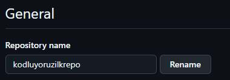

# Kodluyoruz İlk Repo
Bu repo [Kodluyoruz](https://www.kodluyoruz.org/) eğitiminde oluşturduğumuz ilk repo. İçerisinde bir adet README dosyası, bir adet de index.html barındırıyor.



# Installation
Öncelikle projeyi clonelayın.
```bash
git clone https://github.com/ofsezginn/kodluyoruzilkrepo.git
```
# Usage
Projeyi cloneladıktan sonra VS Code programında açınız.

macOS/Linux için:

```
cd kodluyoruzilkrepor
code .
```

# Contributing
Pull requestler kabul edilir. Büyük değişiklikler için, lütfen önce neyi değiştirmek istediğinizi tartışmak için bir konu açınız.

# License
[MIT](https://choosealicense.com/licenses/mit/)